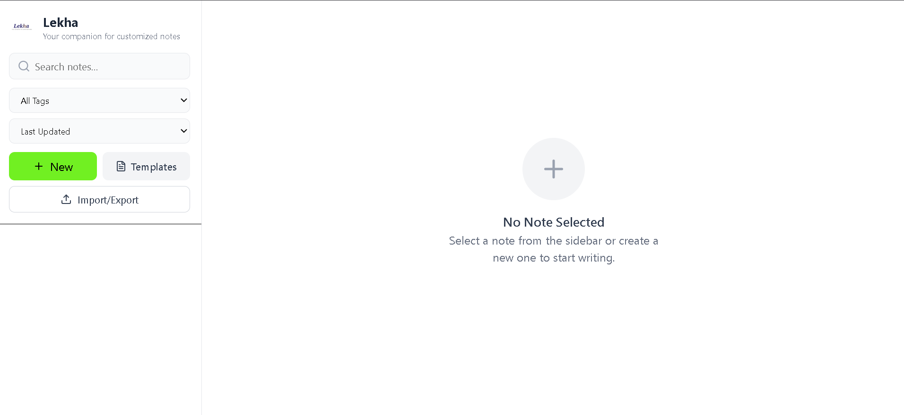
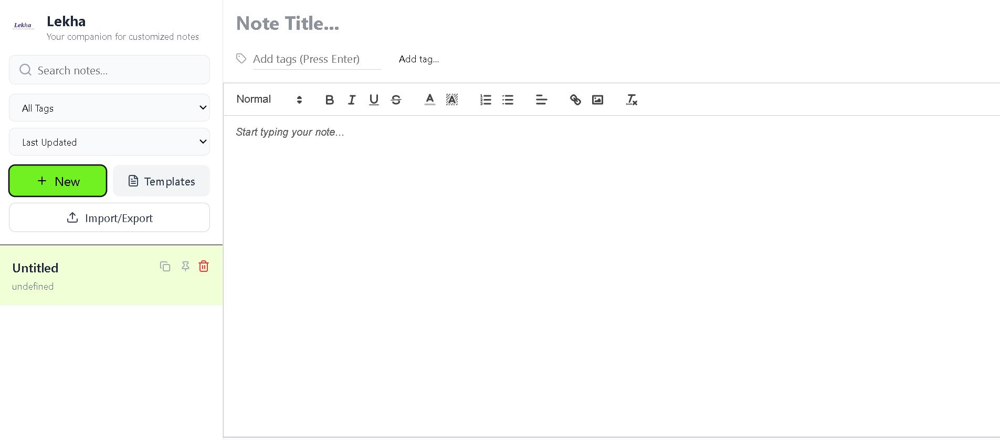
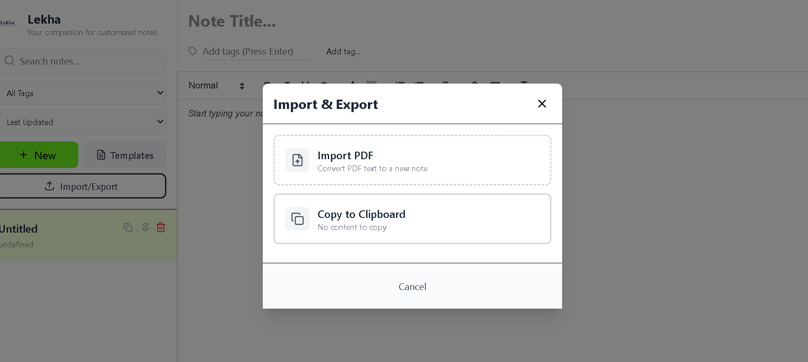
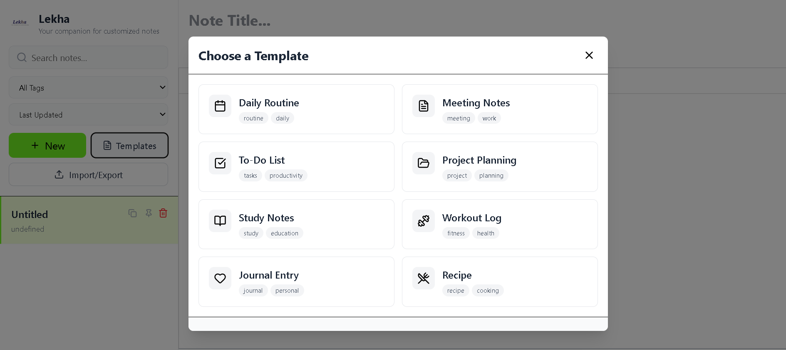
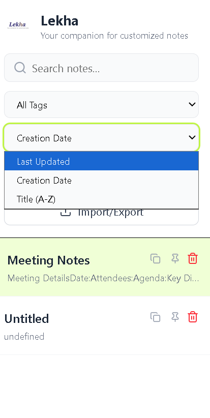
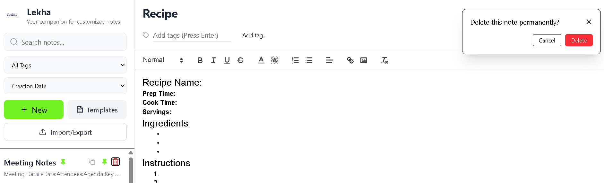

# Lekha - A Note App in React

## About
<div align="center">


Lekha is a note-taking application built with React, featuring a Rich Text Editing experience. This project explores the intersection of
state management and complex text formatting, providing a seamless way to create, style, and organize documents.

</div>

---

## Screenshots







---

## Key Features
### Core Functions
- **Rich Text Editing**: Full support for bold, italics, lists, and headers using React- Quill for now.
- **Live Preview**: See your formatting in real-time as you type.
- **CRUD Operations**:
  - Create: Start new documents with a rich canvas.
  - Read: Browse through a library of formatted notes.
  - Update: Modify existing content without losing formatting.
  - Delete: Clean up your workspace with ease.
- **Auto-Save**: Ensuring your thoughts are never lost.
- **Smart Search**: Instantly find notes by title or content.
- **Tag System**: Organize notes with custom tags.
- **Pin Important Notes**: Keep favorites at top.
- **Multiple Sort Options**: By last updated, created date, or alphabetically.

### Productivity Tools
- **8 Pre-built Templates**
  - Daily Routine
  - Meeting Notes
  - To-Do List
  - Project Planning
  - Study Notes
  - Workout Log
  - Journal Entry
  - Recipe

### Import/Export
- **PDF Import** - Convert PDF text to notes
- **Quick Copy** - Copy any note to clipboard with one click
- **Auto-save** - Never lose your work (saves after 1 second of inactivity)

### User Experience
- **Clean UI** - Minimalist design with green accents
- **Mobile-First** - Optimized for touch devices
- **Real-time Stats** - Word and character count
- **Visual Feedback** - Confirmation for all actions
- **Responsive Sidebar** - Collapsible on mobile

---

## Installation

### Prerequisites
- Node.js 16+ 
- npm or yarn

## Quick Start

```bash
# Clone the repository
# Navigate to project directory
# Install dependencies
# Start development server
# Open browser to http://localhost:5173
```

## Tech Stack

### Frontend
- **React 18** - UI library
- **Vite** - Build tool and dev server
- **Tailwind CSS** - Utility-first CSS framework

### Libraries
- **react-quill-new** - Rich text editor
- **lucide-react** - Icon library
- **LocalStorage API** - Data persistence

### Code Organization
```
src/
├── components/          # Reusable UI components
│   ├── Sidebar.jsx
│   ├── NoteEditor.jsx
│   ├── NoteListItem.jsx
│   ├── TemplateModal.jsx
│   ├── ImportExportMenu.jsx
│   ├── DeleteConfirmationModal.jsx
│   ├── EmptyNoteState.jsx
│   └── MobileHeader.jsx
├── hooks/               # Custom React hooks
│   └── useNotes.js     # Note management logic
├── utils/               # Helper functions
│   ├── noteUtils.js    # Filtering, sorting, text processing
│   └── templates.js    # Pre-built note templates
├── assets/              # Static files
└── App.jsx             # Main app component
```

---

<div align="center">

** If you found this helpful, please consider giving it a star!**

</div>

